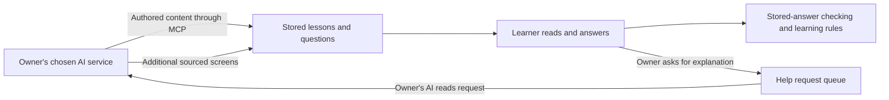

# Worked checklist: Flashkarte/LearnWohl AI-assisted course authoring

**Provisional assessment for Chris — 7 October 2026.** First actual-product example for the [commercial use-case checklist](../../../plans/2026-10-07-eu-ai-act-use-case-decision-checklist.md). This is based on the current local checkout at `265127b`; it does not verify production behaviour, customer contracts or every possible uploaded course.

**Finding:** no Article 5 prohibition or Article 6 high-risk route is established by the reviewed self-study authoring/delivery workflow. That is a conditional finding about this defined use, not a clean bill of health for the whole product. The external AI service's role, a potentially integrated AI system, institutional use and public-content transparency need separate decisions. Lack of server-hosted inference does not by itself exclude a combined AI system.

No product-selection reply had arrived when this draft was prepared, so Flashkarte was used as the provisional first case because its implementation is available here. Replace the case if Chris selects another feature.

## 1. Define the assessed use

An adult course owner connects an external AI assistant to Flashkarte's authoring tools. The assistant drafts or revises sourced lessons. Flashkarte stores the authored screens, questions, answers and prerequisite graph; learners read them and answer multiple-choice questions. The lesson engine compares the selected answer with a stored correct answer and sends a learner to relevant teaching screens after a miss. An owner can ask their own AI for additional explanation, which is inserted as new screens.

**Working purpose:** creating and studying general educational material. This purpose is a proposed boundary, not a verified exhaustive product/contract statement. The case does not assume institutional grading, admissions, educational-level assignment, test surveillance or employment selection. Their actual absence from intended uses and customer arrangements remains to be confirmed.

There are at least three candidate assessment boundaries: the external AI assistant; the platform's authoring integration plus that assistant; and content delivery with rule-based grading. Do not assign the same role or classification automatically to all three.

## 2. Evidence inspected

| Evidence                                                                                     | What it supports                                                                                                          | What it does not prove                                                                                                                         |
| -------------------------------------------------------------------------------------------- | ------------------------------------------------------------------------------------------------------------------------- | ---------------------------------------------------------------------------------------------------------------------------------------------- |
| [AI content authoring guide](../../../ai-content-authoring-guide.md)                         | The chosen AI service runs externally; authoring credentials are limited; AI writing is attributed.                       | Legal role allocation or every customer's actual use.                                                                                          |
| [Authoring workflow](../../../course-authoring-guide.md)                                     | Draft/testing lessons, sourced screens, owner review and decision to finish.                                              | That every owner actually reviews every generated screen before publishing.                                                                    |
| [Learning routes](../../../../packages/server/src/domains/learn/learn.routes.ts)             | AI authoring credentials are refused on learner-action routes; authoring/help and learning actions are separated.         | That no AI system influences learning elsewhere in the complete combined workflow.                                                             |
| [Answer checking](../../../../packages/shared/src/lessons/lesson-session.ts)                 | A selected option is compared with the stored correct index; this component does not infer an answer through an AI model. | That the original questions/answers or prerequisite design were authored without AI.                                                           |
| [Help requests](../../../../packages/server/src/domains/learn/help-requests.service.ts)      | Owner-controlled requests, external AI access and one to three sourced response screens; sources are required.            | Automatic approval by a human or truth of the supplied source/content.                                                                         |
| [Question insights](../../../../packages/server/src/domains/learn/learn-insights.service.ts) | Owner insights are aggregated counts, with no learner identities returned by that endpoint.                               | That the platform has no personal learning data; the underlying records are learner-linked.                                                    |
| [Screen origin display](../../../../packages/web/src/learn/ScreenOrigin.tsx)                 | AI-added help answers can have visible origin text and sources.                                                           | Universal labelling of initially imported AI content, first-exposure compliance, machine-readable marking or retention of upstream provenance. |
| [Lesson attribution](../../../../packages/server/src/domains/lessons/lessons.controller.ts)  | Scoped authoring writes record AI versus human origin.                                                                    | A sufficient Article 50 technical marker or an editorial-review record.                                                                        |

## 3. Run the checklist branches

Answers use **Yes / No on stated facts / Unknown / Not reached**. Unknown is never treated as No. Question IDs below belong to the checklist, not the new course's lesson IDs.

| Branch                                                                             | Answer and reasoning                                                                                                                                                                                                                                                                                                    | Consequence / evidence needed                                                                                                                                             |
| ---------------------------------------------------------------------------------- | ----------------------------------------------------------------------------------------------------------------------------------------------------------------------------------------------------------------------------------------------------------------------------------------------------------------------- | ------------------------------------------------------------------------------------------------------------------------------------------------------------------------- |
| S01 — AI system?                                                                   | **Yes** for the external AI assistant. The stored-answer checker by itself does not establish inference under Article 3(1). **Unknown** for the final boundary of a combined authoring/help product.                                                                                                                    | Document the combined system, who commissions/controls it and the product promise. The model being external is not an exemption.                                          |
| S02 — supplying a GPAI model?                                                      | **No on reviewed facts:** this feature uses an external service; no model training, modification or model placement is shown.                                                                                                                                                                                           | Reopen if a model is modified and supplied.                                                                                                                               |
| S03 — EU connection?                                                               | **Yes under the stated EU-commercial-use assumption.** No global availability or corporate-establishment audit was performed.                                                                                                                                                                                           | Record actual provider/deployer entity, markets and output-use locations.                                                                                                 |
| S04–S05 — exclusion or special sector route?                                       | No exclusion is relied on. A commercial activity is not private deployment merely because an individual uses the app. No Annex I Section B product is identified.                                                                                                                                                       | Keep the ordinary branches open; source any later sector claim.                                                                                                           |
| R01–R07 — roles                                                                    | A commercial course author using the chosen AI is a candidate **deployer** of that system. The external system/model suppliers have separate roles. Whether the platform operator supplies a combined AI system under its own name is **Unknown**. Importer/distributor/model-provider transitions are not established. | Record the service design, contracting entities, branding, authority and model/system supply. One actor may have several roles.                                           |
| P01–P02 — harmful manipulation/exploitation                                        | **No trigger identified** in the inspected authoring/grading flow. Uploaded material, marketing, reward design and use with vulnerable people were not comprehensively audited.                                                                                                                                         | Assess actual purpose/mechanism/significant-harm elements if those uses exist. Teaching or gamification alone does not settle them.                                       |
| P03–P08 — scoring, criminal prediction, scraping and biometrics                    | **No trigger identified** in this reviewed flow. Study progress is not by itself the full prohibited social-scoring test. No emotion inference, biometric categorisation or remote identification was found in the inspected feature.                                                                                   | Do not extrapolate to other features or arbitrary content. Reassess any webcam, voice, scoring or surveillance addition.                                                  |
| P09–P11 — new intimate-media/child-abuse and associated provider/deployer branches | No such generation purpose is shown by this text/course feature. Model capabilities, image pathways, foreseeable reproducible misuse and safeguards were not audited.                                                                                                                                                   | Record the unassessed adjacent pathways; the inserted provisions have a separate 2 December 2026 date.                                                                    |
| H01–H07 — Annex I product route                                                    | **No covered product/safety-component route identified** for this bounded learning feature. Merely teaching medical or safety topics does not itself make the software a medical device or safety component.                                                                                                            | Reassess if the purpose becomes diagnosis, treatment, a covered safety function or another actual Annex I product. Source the sector rule and mandatory assessment facts. |
| H08 — Annex III intended use                                                       | **No listed use established** for general self-study content authoring. Education is a heading, not a universal classification. Institutional evaluation/steering under point 3(b), access/admission under 3(a), level assessment under 3(c) or test surveillance under 3(d) changes the inquiry.                       | Confirm customer/intended-use boundaries. AI-generated explanations or an adaptive product need an assessment of the actual AI function and institutional context.        |
| H09–H12 — profiling and Article 6(3) exception                                     | **Not reached as a derogation:** no Annex III match has been established. Individual learning records are not automatically profiling; an actual AI profiling function needs separate facts.                                                                                                                            | If a listed use is established, test the profiling override and exact exception conditions. Human review does not supply an automatic exception.                          |
| T01 — direct AI interaction                                                        | The owner knowingly uses an external AI client. The inserted explanation/help pathway may form an AI interaction within a combined service: **role/boundary-dependent**.                                                                                                                                                | Check what each person sees at first interaction, the actual provider duty and any substantiated obviousness exception.                                                   |
| T02 — synthetic content                                                            | **Yes:** the AI produces lesson text and potentially other assets. Who bears system-provider marking/detectability duties is **boundary-dependent**.                                                                                                                                                                    | Inspect actual upstream markers and what import/edit/export preserves. Internal AI attribution is not proof of technical compliance.                                      |
| T03–T04 — biometrics/deepfakes                                                     | No biometric use or realistic synthetic likeness is identified in this text-focused case. Realistic image/audio/video content would need a separate content assessment.                                                                                                                                                 | Do not assume all educational assets are outside the deepfake rule.                                                                                                       |
| T05 — public-interest text                                                         | **Potentially Yes** for public AI Act or other public-interest teaching content; publication purpose and audience need a record. Private authoring does not dispose of later public publication.                                                                                                                        | Make a publication-specific decision. A visible disclosure or a substantiated text exception may be needed.                                                               |
| T06–T07 — editorial exception/disclosure quality                                   | **Unknown.** Testing/finished status and general owner review instructions do not prove human review/editorial control plus an accountable person for a particular publication.                                                                                                                                         | Record the relevant version, review/control and responsible publisher, or assess the actual disclosure route and timing/accessibility.                                    |
| B01–B04 — literacy, bias data and small-firm claims                                | Article 4 literacy support needs a record for relevant professional operation. No special-category bias dataset is proposed here. No small-firm waiver is claimed.                                                                                                                                                      | Identify the actual operator and proportionate literacy measures. Open Article 4a only for a real proposed exceptional processing workflow.                               |
| G01–G05 — GPAI duties                                                              | Model-provider status is not established for Flashkarte by external-service use alone.                                                                                                                                                                                                                                  | Procurement and integration need relevant supplier evidence; ordinary API use is not model training or automatic model-provider status.                                   |
| O01–O05 — high-risk duty packs                                                     | **Not triggered on this provisional classification.** This does not establish permission for institutional use or other AI features.                                                                                                                                                                                    | If a listed high-risk use is established, allocate both provider and deployer packs; FRIA has its own actor/use trigger.                                                  |
| O06 — transparency implementation                                                  | **Open:** role allocation, technical provenance, publication decision and actual notices require evidence.                                                                                                                                                                                                              | Separate supplier compliance from the platform's and publisher's own duties.                                                                                              |
| X — experiments/pilots                                                             | This is an existing authoring/delivery use, not an identified real-world high-risk trial. No research or sandbox exclusion is claimed.                                                                                                                                                                                  | Reassess any trial affecting admission, grading or employment; “testing” lesson status is not an AI Act sandbox.                                                          |
| D — dates                                                                          | Article 50 generally applies from 2 August 2026. Article 111(4)'s 2 December 2026 transition concerns only 50(2) for qualifying pre-2-August systems. Relevant placement/service facts are **Unknown** here.                                                                                                            | Record the date for each identified system; do not delay all transparency duties or borrow later high-risk dates.                                                         |
| L — other law                                                                      | Learner records, source uploads, generated teaching accuracy, IP and commercial promises remain separate review items.                                                                                                                                                                                                  | Assess actual data flows, notices, permissions and intended subject uses. No general GDPR/IP/consumer-law clearance is made.                                              |

Legal basis for these branches: [current consolidated AI Act](https://eur-lex.europa.eu/legal-content/EN/TXT/?uri=CELEX:02024R1689-20260727), especially Articles 2–6, 25, 50, 111 and 113 and Annex III point 3; [Commission transparency guidance](https://digital-strategy.ec.europa.eu/en/library/guidelines-transparency-obligations-providers-and-deployers-ai-systems). The source-status limits and detailed tests remain in the linked checklist and programme source register.

## 4. Decisions needed before a firmer finding

| Priority | Decision/evidence                                 | Proposed owner                                                 | What would resolve it                                                                                                              |
| -------- | ------------------------------------------------- | -------------------------------------------------------------- | ---------------------------------------------------------------------------------------------------------------------------------- |
| 1        | Confirm the supplied purpose and actual customers | Chris / product owner                                          | A product statement plus contracts/marketing: self-study versus institutional assessment, educational placement or employment use. |
| 1        | Decide the combined system and roles              | Product owner with a legal reviewer for any borderline finding | Diagram and terms identifying external assistant, integration, control, branding and supply.                                       |
| 1        | Check public AI-authored course publication       | Course publisher                                               | Record a version-specific editorial route/responsibility or the applicable disclosure.                                             |
| 2        | Test provenance through import, edits and export  | Product maintainer / AI supplier                               | Observed supported formats and marker preservation/detection; distinguish visible text from machine-readable evidence.             |
| 2        | Record personal-data and source-material flows    | Product/data owner                                             | What the external AI receives, permissions, purposes, retention and publishing rights.                                             |
| 2        | Confirm age/context and literacy arrangements     | Product owner / professional deployer                          | Actual user groups, access promises and support suited to the relevant operators.                                                  |

These are review actions, not authorisation to change the application, publish content or send material to another service.

## 5. Changes that reopen the decision

- AI assesses individual learning outcomes or steers learning within an educational/vocational institution: re-run Annex III point 3(b), profiling and the full Article 6(3) test.
- AI determines admission/access, education level, cheating detection, candidate selection or employee performance: assess the exact listed education/employment use rather than inheriting this self-study finding.
- A hosted or integrated agent interacts directly with learners or acts on their behalf: redefine system/provider boundaries and interaction disclosure.
- A webcam or voice feature infers emotions in education/work: run Article 5 first; disclosure cannot legitimise a prohibited practice.
- Realistic generated people/voices are published, or teaching material becomes diagnostic/safety advice: reopen deepfake, purpose, sector and other-law branches.
- Models are trained, materially modified or supplied; system design, market, actor or publication route changes: reopen the relevant role, date and evidence record.

**Decision record:** provisional “no high-risk route established for the defined self-study workflow; transparency/roles and adjacent-use facts unresolved”. Confidence is stronger for the inspected component behaviours than for commercial intended use. Reassess when the unresolved facts or any trigger above changes.
